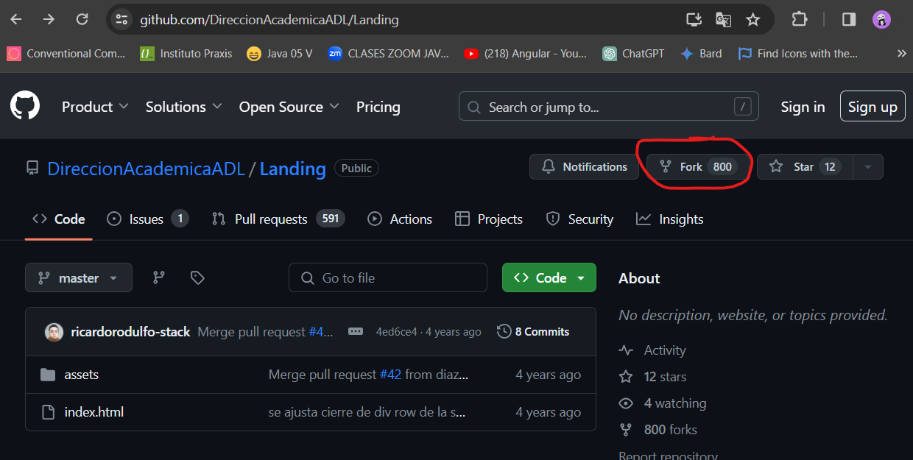
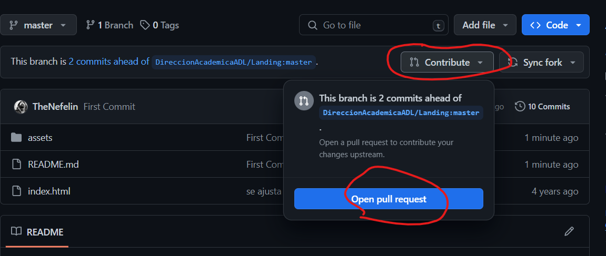
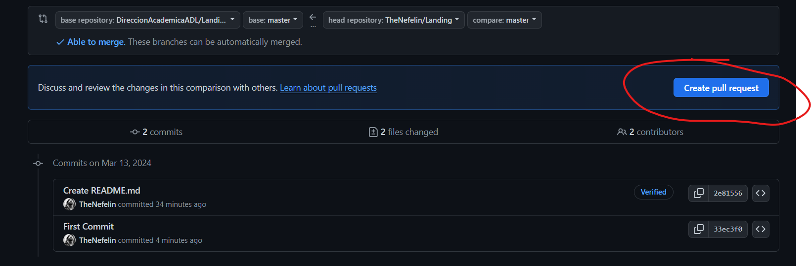

# Desafío - Fork y Pull request 

1. Crear un fork del repositorio.

[Repositorio a Forkear](https://github.com/TheNefelin/Landing)



2. Clonar el repositorio a nuestro computador.
```
  git clone [url]

  code ./Landing
```

3. Generar un cambio simple en el proyecto.
```
  //css

  .button_di-buffala:hover {
    background-color: #fff;
    color: #325DFF;
    border: 1px solid #325DFF;
  }
```

4. Commitear los cambios.
```
  git add .
  git commit -m "First Commit"
```

5. Hacer push a nuestro repositorio forkeado.
```
  git push
```

6. Crear un pull request describiendo los cambios implementados.



